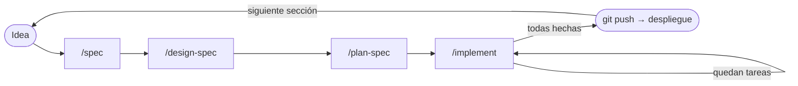

# Flujo de trabajo — personal-website

Cómo se construye el portafolio con las skills del proyecto: de una idea a una
especificación cerrada, un diseño aprobado, un plan de tareas pequeñas y el código.

El flujo es deliberadamente **simple**: 4 skills, sin orquestador ni subagentes. Tú
decides cuándo pasar de etapa; los archivos guardan el estado.

> **Estado actual**: las 4 skills (`/spec`, `/design-spec`, `/plan-spec`, `/implement`)
> están disponibles.

---

## Resumen

| Etapa | Skill | Pregunta que responde | Resultado |
|-------|-------|-----------------------|-----------|
| 1. Especificar | `/spec` | ¿**Qué** se construye y cómo sé que está bien? | `specs/NNN-slug/spec.md` |
| 2a. Sistema de diseño | `/design-spec system` | ¿Cuál es el lenguaje visual de **todo** el sitio? | `designs/000-design-system/design.md` + canvas |
| 2b. Diseñar la spec | `/design-spec NNN` | ¿**Cómo se ve y se mueve** esta spec? | `designs/NNN-slug/design.md` + canvas |
| 3. Planificar | `/plan-spec NNN` | ¿En **qué tareas pequeñas** se divide? | `plans/NNN-slug/plan.md` |
| 4. Implementar | `/implement NNN` | Hacer la siguiente tarea y verificarla | Código + tests + tarea marcada |
| 5. Publicar | `git push` | — | Despliegue automático |



Todas las etapas comparten el mismo nombre de carpeta:

```
docs/cv.md                              ← fuente única de datos profesionales
designs/000-design-system/design.md     ← global, se crea una sola vez
specs/003-home-hero/spec.md
designs/003-home-hero/design.md
plans/003-home-hero/plan.md
src/…  tests/…                          ← /implement
```

---

## Antes de empezar (una sola vez)

1. **Rellenar `docs/cv.md`**: ninguna skill inventa datos; sin CV no hay contenido.
2. **Crear el repositorio git y subirlo a GitHub**: `/implement` hace un commit por tarea.
3. **Conectar el repositorio a un hosting estático** (Vercel, Netlify o Cloudflare Pages):
   a partir de ahí, cada `git push` publica el sitio. No hace falta una skill de release.

## Orden de construcción del sitio

Cada sección del sitio es una spec que recorre el ciclo completo:

| # | Spec | Estado | Notas |
|---|------|--------|-------|
| 001 | `foundation` | ✅ done | Proyecto Astro + Bun + Vitest, esquemas de contenido desde `cv.md`. Sustituye a una skill de bootstrap. Spec **sin interfaz**: su sección Diseño dice "No aplica" y salta `/design-spec` |
| — | `/design-spec system` | ✅ approved | Sistema de diseño global (`designs/000-design-system/design.md`), antes de cualquier spec visual |
| 002 | `design-tokens` | ✅ done | `tokens.css`, estilos base y fuentes autoalojadas desde el sistema de diseño. Spec **sin interfaz** propia: implementa tokens, no pantallas |
| 003 | `home-hero` | pendiente | Primera pantalla |
| 004+ | proyectos, experiencia, contacto… | pendiente | Una spec por sección |

---

## Fuentes que leen todas las skills

| Archivo | Rol | Jerarquía ante conflicto |
|---------|-----|--------------------------|
| `docs/constitution.md` | Principios innegociables | 1 (máxima) |
| `AGENTS.md` | Estilo y reglas del proyecto | 2 |
| `designs/000-design-system/design.md` | Lenguaje visual global | 3 |
| `specs/*/spec.md` | Especificaciones existentes | 4 |
| Petición actual | Lo que pides en la invocación | 5 |
| `docs/cv.md` | **Única** fuente de datos profesionales | — (nunca se inventan datos) |

---

## Etapa 1 — `/spec`: especificar

### Uso

```
/spec hero de la home con presentación profesional
/spec 003          ← refina una spec existente
```

### Qué ocurre

1. **Lee el contexto**: constitución, AGENTS.md, cv.md y todas las specs.
2. **Detecta brechas** (lo que falta para escribir criterios verificables) y
   **contradicciones** (choques con la constitución, AGENTS.md, otras specs o la propia petición).
3. **Pregunta en rondas de hasta 4**, con una opción recomendada, sin límite de rondas
   hasta que no quede nada abierto. Lo que ya responden las fuentes no se pregunta: se anota.
4. **Redacta** la spec con criterios Dado / Cuando / Entonces.
5. **Checklist de calidad** y **resumen para aprobación**, donde eliges el estado:
   `draft` o `active` (solo puede haber una `active`).

### Ejemplo de ronda de preguntas

```
[Contradicción] Pides "barra de progreso de habilidades con porcentajes".
  constitution.md §8: "Prohibido inventar … métricas".
  ○ Mostrar habilidades vinculadas a proyectos reales (Recomendado)
  ○ Añadir los porcentajes a docs/cv.md primero
  ○ Descartar el requisito

[Brecha] ¿Qué acción principal debe ofrecer el hero?
  ○ Ver proyectos (Recomendado)   ○ Descargar CV   ○ Contactar
```

### Archivo resultante (abreviado)

`specs/003-home-hero/spec.md`

```markdown
---
id: 003
title: Hero de la home
status: active
created: 2026-09-14
updated: 2026-09-14
depends_on: [001, 002]
---

# Hero de la home

## Objetivo

Que un reclutador entienda en menos de 5 segundos quién soy, qué hago y
dónde ver mis proyectos.

## Historias de usuario

- **HU-1**: Como reclutador, quiero ver mi nombre, rol y especialidad al entrar
  para decidir si sigo leyendo.
- **HU-2**: Como visitante, quiero un acceso directo a los proyectos.

## Criterios de aceptación

### HU-1

- **CA-1.1**
  - **Dado** que abro la home
  - **Cuando** la página termina de cargar
  - **Entonces** veo nombre, rol y especialidad tomados de `docs/cv.md`
- **CA-1.2**
  - **Dado** que tengo `prefers-reduced-motion: reduce`
  - **Cuando** abro la home
  - **Entonces** el contenido del hero es visible de inmediato, sin animación

### HU-2

- **CA-2.1**
  - **Dado** que estoy en el hero
  - **Cuando** activo "Ver proyectos" con ratón o teclado
  - **Entonces** navego a la sección de proyectos

## Contenido

Nombre, rol y especialidad: sección "Perfil" de `docs/cv.md`.

## Diseño

Pendiente: ejecutar `/design-spec 003`.

## Fuera de alcance

- Formulario de contacto.
- Descarga del CV.

## Registro de decisiones

| Fecha | Tipo | Pregunta / Conflicto | Decisión | Fuente |
|-------|------|----------------------|----------|--------|
| 2026-09-14 | Contradicción | Barras de % de habilidades vs. §8 | Descartado | usuario |
| 2026-09-14 | Brecha | Acción principal del hero | "Ver proyectos" | usuario |
| 2026-09-14 | Implícita | Paleta de colores | Azul/negro | AGENTS.md |
```

### Paso a la siguiente etapa

✅ La spec está aprobada y en `active` (o `draft` si quieres diseñar antes de cerrarla).
➡️ Siguiente: `/design-spec 003`.

---

## Etapa 2a — `/design-spec system`: sistema de diseño (una sola vez)

Se ejecuta **antes del primer diseño de spec**. Si lanzas `/design-spec 003` y aún no
existe `designs/000-design-system/design.md`, la skill te lo explica y crea primero el sistema.

### Qué ocurre

1. Lee la constitución, AGENTS.md, cv.md, `creative-direction.md` y `anti-cliches.md`
   (en `.claude/skills/design-spec/`).
2. Pregunta lo que falte.
3. Invoca **`/design`** con un brief: genera un canvas con **2-3 direcciones** en forma
   de *style tiles* (paleta, tipografía sans + mono, bordes luminosos, cards con spotlight,
   bloque de código, muestra del hero código → UI).
4. Te comparte el enlace del canvas. **Eliges una dirección** (o combinas elementos).
   Puedes retocarla a mano dentro del canvas publicado.
5. Valida contra la lista de clichés y la constitución.
6. Checklist, resumen y aprobación antes de escribir el archivo.

### Archivo resultante (abreviado)

`designs/000-design-system/design.md`

```markdown
---
id: "000"
title: Sistema de diseño
status: approved
canvas: https://claude.ai/…            ← enlace al canvas de /design
created: 2026-09-14
updated: 2026-09-14
---

# Sistema de diseño

## Dirección elegida

Dirección B "Luz en la oscuridad": negro profundo con grid fino y glow azul;
se incorpora el bloque de código de la dirección A.

## Color

| Token | Valor | Uso | Contraste sobre fondo |
|-------|-------|-----|-----------------------|
| `--color-bg` | `#05070d` | Fondo base | — |
| `--color-text` | `#e6edf7` | Texto principal | 16.8:1 |
| `--color-accent` | `#3b82f6` | Azul de marca | — |
| `--color-glow` | `#60a5fa` | Bordes luminosos | — |

## Tipografía

| Token | Familia | Uso |
|-------|---------|-----|
| `--font-sans` | Inter | Contenido |
| `--font-mono` | JetBrains Mono | Código, etiquetas |

## Tokens de movimiento

| Token | Valor | Uso |
|-------|-------|-----|
| `--duration-fast` | `150ms` | Microinteracciones |
| `--duration-base` | `400ms` | Reveals |
| `--duration-slow` | `900ms` | Momentos protagonistas |
| `--ease-out` | `cubic-bezier(0.16, 1, 0.3, 1)` | Entradas |

## Patrones de movimiento

- **Reveal al scroll** — CSS scroll-driven · reduced motion: visible sin transición.
- **Scramble de texto** — Motion · reduced motion: texto final directo.
```

> Los valores de este ejemplo son ilustrativos; los reales salen de la dirección que elijas.

---

## Etapa 2b — `/design-spec NNN`: diseñar una spec

### Uso

```
/design-spec 003
```

### Qué ocurre

1. Comprueba que existen el sistema de diseño y la spec (`active` o `draft`; si está
   en `done`, pide confirmación).
2. Pregunta lo que falte: contenido real, estados, qué merece animación protagonista.
3. Invoca **`/design`** con un brief que incluye el sistema, el contenido real de cv.md y
   los criterios de la spec → **2-3 direcciones**, cada una en **móvil (390px) y
   escritorio (1440px)**, con las animaciones dibujadas como **fotogramas anotados**
   (el canvas es estático).
4. Eliges una dirección; se valida contra los clichés y la constitución.
5. Documenta cada animación (disparador, duración, easing, técnica, versión reduced-motion).
6. Checklist, resumen y aprobación.
7. **Actualiza la sección Diseño de la spec** y añade la entrada en su registro de decisiones.

### Archivo resultante (abreviado)

`designs/003-home-hero/design.md`

```markdown
---
id: 003
title: Hero de la home
spec: specs/003-home-hero/spec.md
status: approved
canvas: https://claude.ai/…
created: 2026-09-15
updated: 2026-09-15
---

# Diseño — Hero de la home

## Dirección elegida

Dirección A: el bloque de código ocupa el centro y se "compila" en la tarjeta.

## Pantallas

| Pantalla | Móvil | Escritorio | Cubre |
|----------|-------|------------|-------|
| Hero — estado final | `hero-m-final` | `hero-d-final` | CA-1.1, CA-2.1 |
| Hero — reduced motion | `hero-m-static` | `hero-d-static` | CA-1.2 |

## Especificación de movimiento

### M-1 — Código → tarjeta

- **Disparador**: carga de la página
- **Elementos**: bloque de código, tarjeta de presentación
- **Propiedades**: opacity, transform, filter (blur)
- **Duración / easing**: `--duration-slow` / `--ease-out`
- **Estado inicial → final**: el código se escribe línea a línea → se desenfoca y la
  tarjeta aparece en su lugar
- **Implementación**: Motion
- **Justificación de Motion**: secuencia encadenada con stagger que CSS no coordina bien
- **Reduced motion**: la tarjeta aparece directamente, sin código ni desenfoque
- **Fotogramas en canvas**: `hero-d-f1`, `hero-d-f2`, `hero-d-f3`

### M-2 — Borde luminoso del botón "Ver proyectos"

- **Disparador**: hover y foco
- **Implementación**: CSS
- **Reduced motion**: borde iluminado estático
- **Táctil**: se muestra iluminado por defecto

## Anti-clichés

- Evitado: foto circular + "Hola, soy…" → sustituido por código → tarjeta.
```

### Cambio que se aplica a la spec

`specs/003-home-hero/spec.md`

```diff
 ## Diseño

-Pendiente: ejecutar `/design-spec 003`.
+Diseño aprobado: [designs/003-home-hero/design.md](../../designs/003-home-hero/design.md)
+· [canvas](https://claude.ai/…)
```

```diff
 | 2026-09-14 | Implícita | Paleta de colores | Azul/negro | AGENTS.md |
+| 2026-09-15 | Diseño | Dirección visual del hero | Dirección A (código → tarjeta) | /design-spec |
```

### Paso a la siguiente etapa

✅ `designs/003-home-hero/design.md` en `approved` y enlazado en la spec.
➡️ Siguiente: `/plan-spec 003`.

---

## Etapa 3 — `/plan-spec NNN`: planificar

Divide la spec en **tareas pequeñas, ordenadas y verificables** (divide y vencerás).
No genera código, ni diseño, ni modifica la spec.

### Uso

```
/plan-spec 003          ← crea el plan, o lo actualiza si ya existe
```

### Qué ocurre

1. **Comprueba la entrada**: spec en `active` y `design.md` en `approved`
   (salvo specs sin interfaz). Si falta algo, se detiene y te dice qué ejecutar.
2. **Busca brechas y contradicciones** entre spec, diseño y constitución. Si hay alguna,
   **se detiene y te deriva** a `/spec` o `/design-spec`: el plan nunca corrige la spec.
3. **Divide por capas**: datos → estructura estática → estilos → movimiento → pulido →
   **verificación final** (siempre la última). Una tarea = una unidad verificable con su test.
4. **Máximo ~10 tareas**; si salen más, propone dividir la spec.
5. **Checklist** (toda CA cubierta, toda animación con reduced-motion…), resumen con
   matriz CA → tareas y **aprobación** → `status: approved`.

### Archivo resultante (abreviado)

`plans/003-home-hero/plan.md`

```markdown
---
id: 003
title: Hero de la home
spec: specs/003-home-hero/spec.md
design: designs/003-home-hero/design.md
status: approved
created: 2026-09-16
updated: 2026-09-16
---

# Plan — Hero de la home

Leyenda: `[ ]` pendiente · `[x]` hecha · `[-]` obsoleta

## Cobertura de criterios

| Criterio | Tareas |
|----------|--------|
| CA-1.1 | T01, T02 |
| CA-1.2 | T05 |
| CA-2.1 | T02, T04 |

## Tareas

### [ ] T01 — Función de perfil para el hero

- **Criterios**: CA-1.1
- **Diseño**: —
- **Archivos**: `src/lib/profile.ts` (crear), `tests/lib/profile.test.ts` (crear)
- **Qué hacer**: función pura `getHeroProfile` que devuelve nombre, rol y especialidad
  desde la colección `profile`.
- **Test**: devuelve los tres campos; falla de forma explícita si falta alguno.
- **Terminado cuando**:
  - Test en verde.

### [ ] T02 — `Hero.astro` estático

- **Criterios**: CA-1.1, CA-2.1
- **Diseño**: `hero-m-final`, `hero-d-final`
- **Archivos**: `src/components/Hero.astro` (crear), `src/pages/index.astro` (modificar)
- **Qué hacer**: sección semántica con `h1` (nombre), rol, especialidad y enlace
  "Ver proyectos" a `#projects`. Sin JS.
- **Test**: el HTML renderizado contiene los datos de `cv.md` y el enlace a `#projects`.
- **Terminado cuando**:
  - Test en verde.
  - Contenido visible y navegable con JS desactivado.

### [ ] T03 — Estilos del hero con tokens
### [ ] T04 — M-2 borde luminoso del botón (CSS)
### [ ] T05 — M-1 código → tarjeta (Motion) + reduced-motion

- **Criterios**: CA-1.2
- **Diseño**: `hero-d-f1`…`hero-d-f3` · `M-1`
- **Archivos**: `src/components/Hero.astro` (modificar)
- **Qué hacer**: `<script>` de Astro con Motion: secuencia código → blur → tarjeta,
  con `--duration-slow` / `--ease-out`. Con reduced-motion no se ejecuta.
- **Test**: con reduced-motion la tarjeta está visible sin animación; el contenido
  existe en el HTML aunque no se ejecute el script.
- **Terminado cuando**:
  - Test en verde.
  - Comprobación manual contra `hero-d-f1`…`f3` y con reduced-motion activado.

### [ ] T06 — Verificación final

- **Terminado cuando**: todas las CA con test, test + build en verde, reduced-motion,
  contraste AA, teclado, revisión visual contra el canvas y Lighthouse ≥ 90.
```

### Replanificar

Si la spec o el diseño cambian, `/plan-spec 003` **actualiza** el plan: conserva las
tareas `[x]`, marca `[-]` las que ya no aplican, añade nuevas con numeración correlativa
y registra el motivo.

➡️ Siguiente: `/implement 003`.

---

## Etapa 4 — `/implement NNN`: implementar

Ejecuta **una sola tarea** del plan y se detiene. Repites el comando hasta completar el plan.

### Uso

```
/implement 003          ← primera tarea [ ] del plan
/implement 003 T04      ← una tarea concreta (avisa si se salta tareas anteriores)
```

### Qué ocurre

1. **Comprueba la entrada**: plan `approved`, spec `active`. Si la spec o el diseño son
   más recientes que el plan, avisa de que puede estar desfasado.
2. **Busca brechas antes de tocar código**. Si la tarea no se puede hacer sin inventar
   decisiones, **se detiene**, deja una nota **Bloqueo** en la tarea y te deriva a
   `/spec`, `/design-spec` o `/plan-spec`.
3. **TDD rojo → verde → refactor**: escribe el test descrito en el plan, comprueba que
   falla, implementa lo mínimo hasta verde y refactoriza.
4. **Reglas**: solo toca los archivos de la tarea (si necesita otro, pregunta); instala
   dependencias solo si la tarea las indica, con `bun add` y tu confirmación; solo tokens
   del sistema de diseño; animaciones con rama reduced-motion.
5. **Fallos**: hasta 3 intentos de corrección; después se detiene con un informe.
6. **Verificación**: `bun run test` + `bun run build` en verde y autorrevisión con checklist
   (constitución, tokens, fidelidad a `design.md`, reduced-motion, accesibilidad, datos de cv.md).
7. **Comprobaciones manuales** (tareas visuales): levanta el sitio, toma capturas en Chrome
   a 390px y 1440px, te las muestra junto a los artboards y **espera tu confirmación**.
8. **Cierre de tarea**: marca `[x]`, te muestra el diff y el mensaje de commit y, tras tu
   confirmación, hace el commit. **Nunca hace push.**

### Ejemplo de commit

```
feat(003): T02 add static hero markup

Covers CA-1.1, CA-2.1
Plan: plans/003-home-hero/plan.md
```

### Ejemplo de informe

```
✅ T02 — Hero.astro estático
   Archivos: src/components/Hero.astro (nuevo), src/pages/index.astro
   Test: tests/components/hero.test.ts → CA-1.1, CA-2.1
   bun run test ✔ 8 passed · bun run build ✔
   Commit: feat(003): T02 add static hero markup
   Siguiente: /implement 003  → T03 Estilos del hero con tokens
```

### Ejemplo de tarea bloqueada

```markdown
### [ ] T03 — Estilos del hero con tokens

- **Bloqueo**: 2026-09-17 — design.md no define el espaciado vertical del hero en móvil —
  ejecutar `/design-spec 003`
```

### Última tarea

Cuando no quedan tareas `[ ]`, propone marcar plan y spec como `done`, lo aplica tras tu
confirmación y sugiere `git push` y la siguiente spec.

➡️ `git push` (publica el sitio) y siguiente spec del orden de construcción.

---

## Condiciones para pasar de etapa

| De → a | Condición | Qué pasa si no se cumple |
|--------|-----------|--------------------------|
| Idea → `/spec` | `docs/cv.md` con los datos necesarios | La skill pregunta por cada dato que falte |
| `/spec` → `/design-spec` | Spec en `active` o `draft`, aprobada | `/design-spec` sugiere ejecutar `/spec` |
| `/design-spec system` → `/design-spec NNN` | `designs/000-design-system/design.md` aprobado | Se diseña primero el sistema |
| `/design-spec` → `/plan-spec` | Spec `active` + `design.md` `approved` (o spec sin interfaz) | `/plan-spec` se detiene e indica qué ejecutar |
| `/plan-spec` → `/implement` | Plan `approved`, sin brechas, ≤ ~10 tareas | Se deriva a `/spec` o `/design-spec`, o se propone dividir la spec |
| `/implement` → `git push` | Todas las tareas `[x]`, tests y build en verde | Se sigue con `/implement` |

---

## Iterar y corregir

| Situación | Qué hacer |
|-----------|-----------|
| Cambia un requisito | `/spec 003` → refina y registra la decisión |
| La spec cambió y afecta al diseño | `/design-spec 003` → pregunta si regenerar el canvas o solo actualizar la documentación |
| Retoques visuales finos | Edita directamente el canvas publicado (enlace en `design.md`) |
| Cambiar la identidad visual de todo el sitio | `/design-spec system` |
| Cambiar la dirección creativa o los clichés | Pídelo explícitamente; se editan `creative-direction.md` / `anti-cliches.md` |
| Revisión de código opcional | `/code-review` (integrada en Claude Code) |
| Revisión visual | Abre el sitio o pide "revisa en Chrome" y compáralo con el canvas |
| Cambiar un principio de la constitución | Solo por petición explícita; ninguna skill lo hace por su cuenta |

---

## Principios del flujo

- **Una skill, una responsabilidad**: qué (`/spec`), cómo se ve (`/design-spec`), en qué
  pasos (`/plan-spec`), hacerlo (`/implement`).
- **El estado vive en los archivos**: `status` en frontmatter y casillas en `plan.md`.
- **Nada se escribe sin tu aprobación** en spec, diseño y plan.
- **Ninguna skill inventa datos** fuera de `docs/cv.md` ni modifica la constitución o
  AGENTS.md sin petición explícita.
- **Añadir piezas solo cuando duela**: si algo se vuelve repetitivo, se crea la skill que
  falte, no antes.
